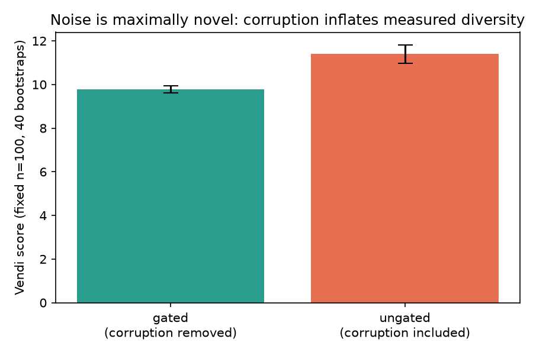
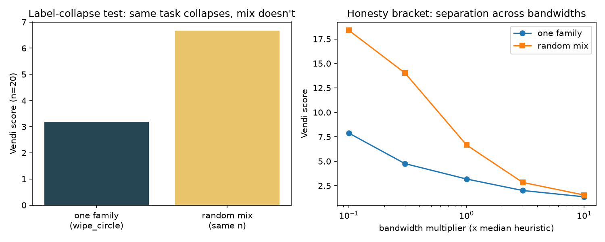
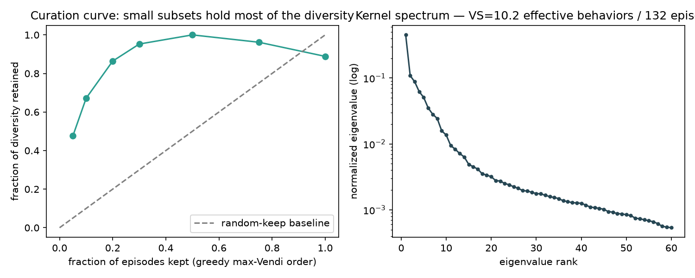

# MotionVendi

**Gated motion-diversity measurement and curation for egocentric robot-learning data.**

Built in one day for the EgoVerse Data Optimization & Evaluation Suite hackathon (Tracks 1 + 2).

---

## The core problem

Robot foundation models are trained by imitation on huge corpora of egocentric human demos. EgoVerse is sold in **hours** (4,001 hrs / ~439k episodes), but hours are not information:

- Task labels are a broken long tail — 27,997 distinct free-text strings; **345 different labels all mean "washing dishes."** Text lies about behavior.
- Redundancy is systematic — 76% of operator-labelled episodes sit in same-task-same-operator blocks of ≥5. The 400th identical demo adds ~nothing.
- The metadata you'd curate with is missing or unlabeled (operator 19% filled, success labels have **no negative class**).

So the two questions no one can answer deterministically — *which episodes are worth training on?* and *how diverse is this subset, really?* — must be answered from the only signal that is universal, cheap, and actually about the behavior itself: **the motion**.

## The hypothesis

> An episode's training value = **quality x novelty**, and both are measurable from pose streams alone — no labels, no LLM judge, no policy training.

Two first-principles claims fall out:

1. **Noise is maximally novel.** A glitched tracker produces the most "diverse" trajectories in the corpus, so any diversity metric applied to ungated data doesn't just tolerate corruption — it *rewards* it. Quality gating is a **precondition** of diversity measurement, not a separate step. (We demonstrate this quantitatively: see E2.)
2. **The kernel is the definition of behavior.** Two demos are "the same behavior" iff they differ only by nuisance — world origin, speed profile, appearance, executor. Delete each nuisance with an explicit quotient (head-frame transform, **arc-length** reparameterization, 6D rotations) and what survives is the shape of the motion. Diversity is then the **effective number of distinct shapes**: the Vendi Score (Friedman & Dieng, TMLR 2023) — exp-entropy of the similarity-kernel spectrum.

## The pipeline

```
episodes ──► GATES ──────► QUOTIENT ─────► KERNEL ──────► VENDI ────► CURATE
             is the        delete           when are two   effective   greedy keep-list,
             measurement   nuisance:        motions "the   number of   most-redundant-first
             true?         head frame,      same"? RBF     distinct    drop ranking,
             (teleports,   arc-length,      on behavior    behaviors   curation curve
             NaN, frozen,  6D rotation      vectors, PSD-
             quat, rot-                     validated
             rate limits)
```

Every design decision is one sentence: *it deletes a nuisance variable or it enforces an invariant of the metric.*

## Novel contributions

1. **Gate-then-measure, quantified.** We show corruption **inflates measured diversity by +16%** (bootstrap CI, fixed sample size) — turning "clean your data first" from folklore into a measured failure mode of diversity metrics.
2. **Arc-length (not time) resampling as the speed quotient.** Uniform-in-time resampling fails to identify the same path executed at different speed profiles; arc-length reparameterization provably does (unit-tested invariance). Our own validation caught this: planted duplicates went from **0% to 75% NN-recall@1** after the fix.
3. **Size-fair subset ranking.** Vendi is bounded by n and *not monotone* under subset growth, so raw scores can't rank subsets of different sizes — we use fixed-size bootstrap resampling with CIs, and a peak-normalized curation curve.
4. **A fully falsifiable validation harness.** Synthetic corpus with planted ground truth (6 behavior families, near-duplicates that differ *only* by nuisance, 4 corruption types) reporting industry-standard metrics: precision/recall/F1/AUROC for gates, NN-recall@k for duplicate detection, and a two-sided label-collapse control.

## Results (synthetic ground-truth corpus, 156 episodes)

| Experiment | Metric | Result |
|---|---|---|
| E1 Gate detection (24 planted corruptions) | Precision / Recall / F1 / AUROC | **1.00 / 1.00 / 1.00 / 1.00** |
| E2 Noise inflates diversity | ungated vs gated Vendi (n=100, 40 boots) | **11.4 vs 9.8 (+16.4% fake diversity)** |
| E3 Label collapse | one family vs random mix (n=20 each) | **3.2 vs 6.7 effective (ratio 0.48)**, separation holds across a 100x bandwidth sweep |
| E4 Duplicate retrieval (12 planted pairs) | NN-recall@1 / @5 | **0.75 / 0.83** |
| E5 Curation curve | diversity retained @ 10% kept | **67%** (vs 10% for random keep) |





Full numbers: [`report/metrics.json`](report/metrics.json) · Full write-up: [`report/REPORT.md`](report/REPORT.md)

## Run it

```bash
uv venv .venv --python 3.11 && source .venv/bin/activate
uv pip install -e ".[dev]"
python -m pytest tests/ -q          # 33 tests
python experiments/run_validation.py  # 5 experiments -> report/figures + metrics.json
```

Real EgoVerse data: `motionvendi/zarr_loader.py` reads a folder of per-episode `.zarr` stores **pose-arrays-only** (skips `images.front_1`, which is nearly all the bytes), gates each episode with an auditable evidence report, and emits the same behavior vectors. Scale-vendor episodes (no `obs_head_pose`) fall back to first-frame normalization and should be reported as a separate stratum.

## Honest limitations

- The pose kernel is object-blind: folding a towel and folding paper are one behavior to it. Appearance/semantic kernels can be added as fixed-weight PSD components (never per-pair reweighted — that breaks PSD).
- Arc-length deletes speed entirely; where speed *is* the skill (pouring), add it back as an explicit feature.
- Corpus-scale Vendi is a sample estimate (eigendecomposition caps at ~10^3-10^4); we report bootstrap CIs, not a point value.
- Validated on ground-truth synthetic data by design (falsifiability first); real-data runs use the identical code path via the zarr loader.
